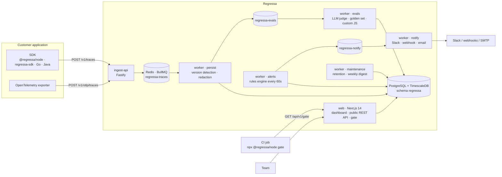
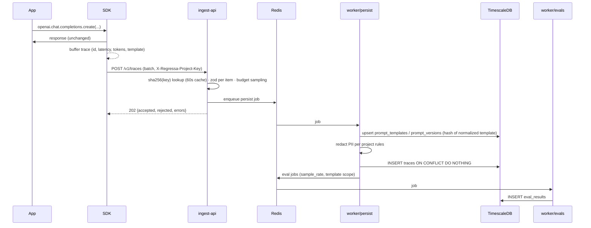

# Regressa architecture

Regressa is a multi-tenant LLM observability and prompt-regression platform. This document describes the
system as built in this repository: components, data flow, storage, tenancy, and the trade-offs behind them.

## System overview



## Components

| Component | Path | Role |
|---|---|---|
| Ingest API | `apps/ingest-api` | Authenticates project keys, validates payloads item by item, assigns ids, applies budget sampling, enqueues. Stateless; scale horizontally. |
| Worker | `apps/worker` | Five BullMQ consumers in one process (persist, evals, alerts, notify, maintenance). Scale by running more replicas; job schedulers are deduplicated by id. |
| Web | `apps/web` | Dashboard (server components read Postgres directly), public REST API, CI gate endpoint, OIDC SSO, Stripe. |
| DB package | `packages/db` | SQL migrations (source of truth), Drizzle models, key hashing, seed. |
| Shared types | `packages/shared-types` | Zod schemas for the wire format, model pricing, redaction presets, anomaly math, plan limits. |
| SDKs | `packages/sdk-*` | Buffered clients that wrap provider SDKs and ship traces with retries. Dependency-free where possible. |

## Request lifecycle



Idempotency: the ingest API assigns a UUID and timestamp to every trace before enqueueing. The primary key on
`traces` is `(id, created_at)`, so a retried persist job cannot duplicate rows.

## Prompt-version detection (the regression core)

Every trace may carry `prompt_template: { name, raw }`. The worker normalizes `raw` (CRLF to LF, trailing
whitespace trimmed, outer blank lines removed), hashes it with SHA-256, and upserts `prompt_versions` keyed by
`(template, hash)`. A new hash becomes version N+1 and fires `prompt_version_change` rules immediately. All
metrics (eval score, p95, error rate, cost) can then be compared per version, which is what the Prompts page,
the CI gate, and the anomaly detector use.

## Evals

| Type | Runs where | Cost |
|---|---|---|
| `llm_judge` | Anthropic Messages API with a forced `submit_score` tool call; 0-100 mapped to 0-1 | judge model tokens, recorded per result |
| `semantic_similarity` | OpenAI embeddings; best cosine similarity to cached golden embeddings | embedding tokens |
| `custom_function` | `node:vm` sandbox, 250ms timeout, no `require`/`process` | free |

Evals are sampled per definition (`sample_rate`) and optionally scoped to one template. The eval worker is
rate-limited to 60 jobs/minute by default to protect provider quotas.

## Alerting

Rules are evaluated every 60 seconds over rolling windows with per-rule cooldowns and minimum sample sizes.

| Condition | Semantics |
|---|---|
| `gt` / `lt` | current window vs absolute threshold |
| `pct_change` | current window vs the immediately preceding window |
| `anomaly` | z-score of the current window vs the previous 24 windows (5% stddev floor) |
| `budget` metric | month-to-date spend vs the project cap; also toggles ingest sampling |
| `prompt_version_change` | fired inline by the persist worker |

Notifications go through a separate queue with retries; delivery state is recorded on `alert_events`.

## Storage

- `traces` and `eval_results` are Timescale hypertables with 1-day chunks and a 90-day table-level retention
  policy. A per-project retention job enforces shorter plan or override windows.
- `traces_hourly` and `eval_scores_hourly` are continuous aggregates for long-range charts.
- Dashboard queries for the active range read the hypertables directly so the UI is always fresh.
- Timescale forbids foreign keys between hypertables, so `eval_results` references traces by
  `(trace_id, trace_created_at)` without a constraint.

See [docs/data-model.md](docs/data-model.md) for the table-by-table reference.

## Tenancy and security

- Hierarchy: `orgs -> projects -> api_keys -> traces`. Every dashboard query is scoped by the session's active
  project; every API and ingest query by the key's project. Project ids are never taken from user input.
- API keys are random 32-char base62 with an `rgsa_live_` / `rgsa_test_` prefix; only the SHA-256 is stored.
- Sessions are HMAC-signed cookies; passwords use scrypt with per-user salts; OIDC id_tokens are verified
  against the provider JWKS.
- PII redaction runs before anything is written. Custom eval code runs in a locked-down VM.
- Security-relevant actions are written to `audit_log`.

## Scaling notes

- Ingest is CPU-light JSON validation; 1 vCPU handles thousands of traces/second. Batch from the SDK.
- Persist concurrency defaults to 8 per worker replica; version upserts are the only contended writes.
- Move `traces` to compression after 7 days and adjust `chunk_time_interval` when daily volume exceeds ~10M rows.
- Redis needs persistence (AOF) so queued traces survive restarts.

## Repository layout

```
apps/            web, ingest-api, worker
packages/        db, shared-types, sdk-node (+ gate CLI), sdk-python, sdk-go, sdk-java
infra/           docker-compose (TimescaleDB, Redis), terraform stub
docs/            product and operator documentation (published to GitHub Pages)
.github/         CI, Pages deploy, reusable regressa-gate action
```
