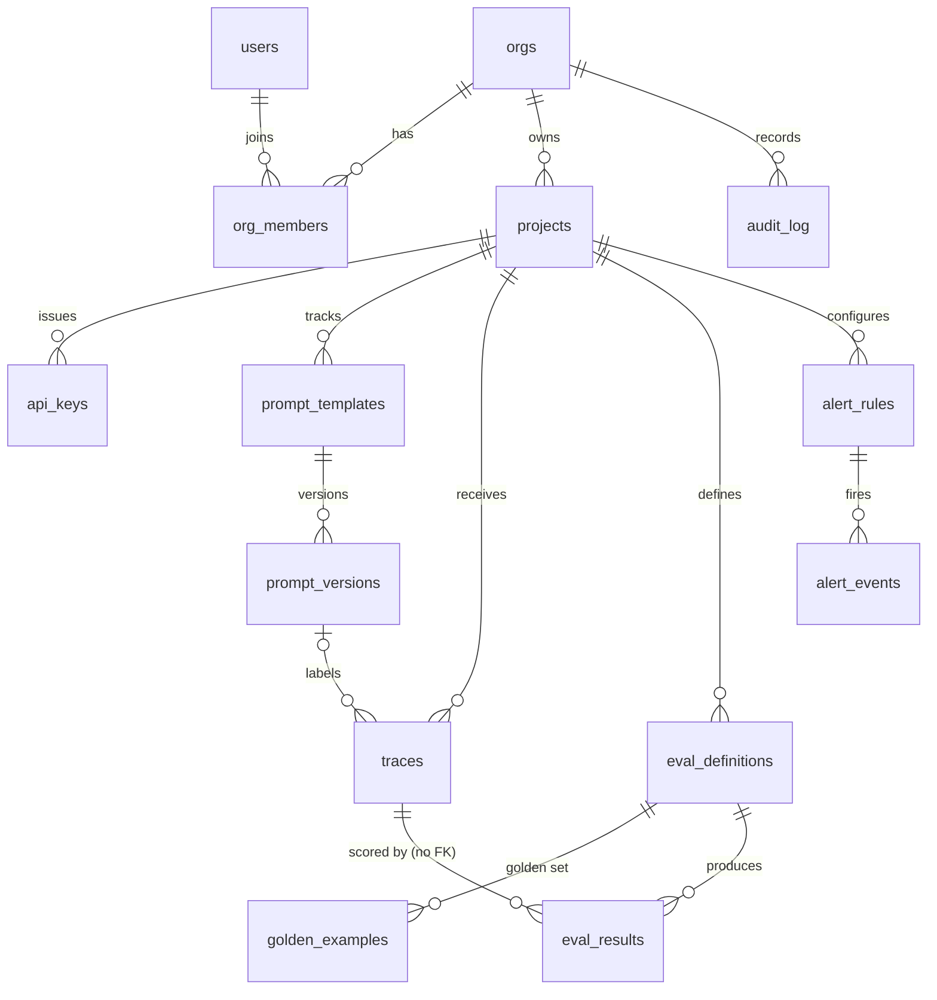

# Data model

Schema `regressa` in PostgreSQL with TimescaleDB. Migrations in `packages/db/migrations` are the source of truth.

## Tenancy

| Table | Purpose | Notable columns |
|---|---|---|
| `orgs` | Billing and SSO boundary | `plan`, `stripe_customer_id`, `sso_domain`, `sso_default_role`, `weekly_digest` |
| `users` | People | `email` (unique), `password_hash` (scrypt), `oidc_sub` |
| `org_members` | Membership | `role` = owner / admin / member |
| `projects` | Unit of data isolation | `environment`, `budget_monthly_usd`, `budget_action`, `budget_exceeded_at`, `redaction_rules` (JSONB), `retention_days` |
| `api_keys` | Ingest and API auth | `key_hash` (sha256), `key_prefix` (display), `mode` live/test, `revoked_at`, `last_used_at` |

## Prompt versioning

| Table | Purpose | Notable columns |
|---|---|---|
| `prompt_templates` | Named template per project | unique `(project_id, name)` |
| `prompt_versions` | One row per distinct normalized template | `version_number`, `content_hash`, `raw_template`, `first_seen_at`; unique on `(template, hash)` and `(template, version_number)` |

## Telemetry (hypertables)

| Table | Purpose | Notable columns |
|---|---|---|
| `traces` | One LLM call | `model`, `provider`, `input_messages` (JSONB), `output_text`, tokens, `total_cost_usd`, `latency_ms`, `status`, `error_message`, `trace_group_id`, `metadata` (JSONB, GIN indexed); PK `(id, created_at)` |
| `eval_results` | One score per (trace, eval) | `score` 0-1, `passed`, `reasoning`, `eval_cost_usd`; references `(trace_id, trace_created_at)` |

Continuous aggregates: `traces_hourly` (count, cost, tokens, avg/p95 latency via `percentile_agg`, errors) and
`eval_scores_hourly` (count, avg, pass count), refreshed every 15 minutes.

## Evals and alerts

| Table | Purpose | Notable columns |
|---|---|---|
| `eval_definitions` | What to score | `type`, `config` (JSONB), `sample_rate`, `prompt_template_id` (scope), `is_active` |
| `golden_examples` | Reference outputs for similarity | `expected_output`, cached `embedding` |
| `alert_rules` | Conditions and channels | `metric`, `condition`, `threshold`, `window_minutes`, `cooldown_minutes`, `channel`, `channel_config`, scopes |
| `alert_events` | Fired alerts | `triggered_value`, `baseline_value`, `message`, `status` open/acknowledged/resolved, `notified_at`, `notify_error` |

## Governance

| Table | Purpose |
|---|---|
| `audit_log` | Who did what: `action` (e.g. `api_key.create`), `target`, `meta`, `actor_email`, `project_id` |

## Metadata conventions

- `metadata.regressa_run`: CI run id; used by the gate and exempt from budget sampling.
- `metadata.otel`: populated by the OTLP ingest route (`trace_id`, `span_id`, `service`).
- Anything else is free-form and searchable via the GIN index.
